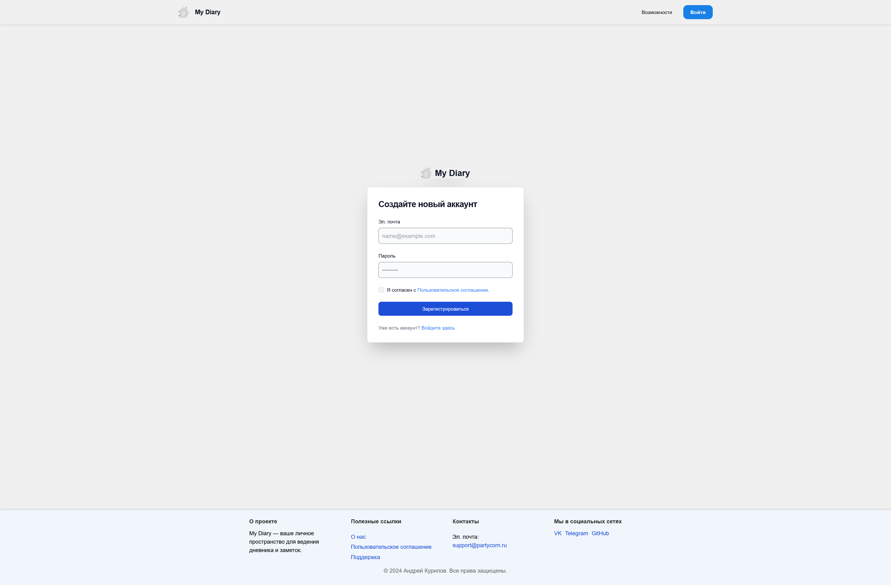

# My Diary

**My Diary** — это личный веб-дневник, где пользователи могут создавать, редактировать и организовывать свои заметки с помощью хештегов и календаря. Веб-приложение поддерживает многопользовательскую систему с авторизацией, а также включает функции персонализации, такие как выбор темы и цветовой схемы.

## О проекте

**My Diary** предоставляет пользователям удобное пространство для ведения личных записей с интуитивно понятным интерфейсом. Записи можно легко организовывать с помощью хештегов и фильтров по дате. Также доступна поддержка нескольких языков (ru, en, de, es, it, fr, pl, ja).

### Ключевые возможности:

- Создание и редактирование заметок.
- Управление записями через хештеги и календарь.
- Персонализация темы и цветовой схемы.
- Авторизация с защитой данных пользователей.
- Многоязычная поддержка интерфейса.

## Лицензия

Код проекта защищен лицензией, которая предоставляет права только на просмотр исходного кода. Пожалуйста, ознакомьтесь с условиями лицензии для подробностей.

[Полный текст лицензии](.license)

## Скриншоты

